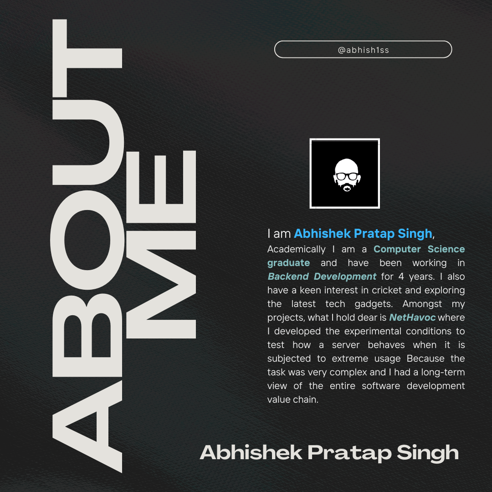

## Favourite Tech

  &nbsp;
  &nbsp;
  &nbsp;

<!-- <html> -->
<!--   <head> -->
<!--   </head> -->
<!--   <body> -->
<!--
  <h1> Hey! Nice to see you.</h1> -->
<!--    -->
<!--    -->
<!--

  
  
   
  

 -->
## Favourite Tech

  &nbsp;
  &nbsp;
  &nbsp;

<!-- </body> -->
<!-- </html> -->
<!--
**abhish1ss/abhish1ss** is a ✨ _special_ ✨ repository because its `README.md` (this file) appears on your GitHub profile.

Here are some ideas to get you started:

- 🔭 I’m currently working on ...
- 🌱 I’m currently learning ...
- 👯 I’m looking to collaborate on ...
- 🤔 I’m looking for help with ...
- 💬 Ask me about ...
- 📫 How to reach me: ...
- 😄 Pronouns: ...
- ⚡ Fun fact: ...
-->
