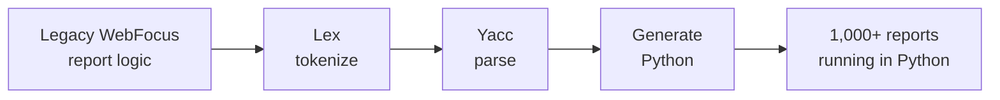

# Abhishek Pratap Singh

**Backend engineer · Java, Spring Boot, AWS · 7+ years across fintech, logistics, and telecom**

I replace vendor tools and manual processes with in-house backend systems, and I migrate teams onto them without breaking the people who depend on the old ones.

Open to senior and lead backend engineering roles · Immediate joiner · Based in India

<!-- TODO: replace RESUME_URL with a link to your résumé (Drive link or a page on your portfolio). Remove this line if you prefer not to link it. -->
[Résumé](RESUME_URL) · [LinkedIn](https://www.linkedin.com/in/abhish1s) · [Portfolio](https://abhicodesdev.vercel.app/) · [Email](mailto:abhishekssiin@gmail.com)

[About](#about) · [Selected work](#selected-work) · [Toolbox](#toolbox) · [Currently](#currently) · [Background](#background) · [Contact](#contact)

---

## About

Most of my work starts with something a team depends on but doesn't control: a paid third-party API inside a KYC pipeline, a proprietary reporting tool reaching end of vendor support, pricing changes run as hand-written SQL against production. I build the in-house replacement and move everyone onto it without downtime.

Over seven years that has taken me from chaos engineering in C to backend services for telecom billing, Amazon logistics, and digital lending, leading small engineering teams along the way.

---

## Selected work

### Replacing a paid KYC dependency
**FreechargeBiz · Lead Software Engineer**

Loan applications were verified by calling Karza, a third-party API, to match each applicant's employer name against EPFO records. I built an in-house matching engine combining Jaro-Winkler and token-based similarity. It removed ~400 daily vendor calls (about $12K+ a year) and took an external dependency out of the KYC pipeline.

### Migrating shared storage with zero downtime
**FreechargeBiz · Lead Software Engineer**

Five-plus teams were writing loan documents to the root of a single S3 bucket. I restructured it into team-scoped hierarchies, using dual-path reading and backward-compatible presigned URLs so the 7+ partner integrations serving documents to end users kept working throughout, and enabled per-team access controls in the process.

### Ending stale deployments across 60+ fulfillment centers
**Amazon (via BCT Consulting) · Senior Software Development Engineer**

After each release, warehouse operators across Amazon India's 60+ fulfillment centers could keep running cached assets, a recurring source of support escalations that pulled engineering time into cache debugging. Content-hash-based cache busting in the JSP rendering layer guaranteed the latest static resources loaded after every deployment, with no manual hard refresh.

How content-hash cache busting works

 

Each static file's name includes a hash of its contents, so any change produces a new URL. Browsers have never cached that URL, so they fetch the new file immediately, while files that didn't change keep their old names and stay cached.

I also built the Bill of Lading module that was a prerequisite for launching Amazon's GCP web application in Australia, automating package load and unload documentation across 6 fulfillment centers.

### Cutting issue reproduction from days to minutes
**Accolite Digital · Senior Software Engineer**

Reproducing production issues for corrugated manufacturing plants meant rebuilding each machine's configuration by hand, which took hours or days. I built a Link Simulator that replicates communication between the main controller and plant hardware (Bobst MPC3 Easy protocol) across multiple machine-specific protocols, with a UI for saving and reusing machine setups. Reproduction now takes minutes.

I also owned end-to-end integration of the Link Communications modules that let the controller communicate with multiple machines simultaneously on the factory floor.

### Retiring a proprietary platform with a transpiler
**Amdocs · Software Engineer**

More than 1,000 billing reports for carriers including Vodafone, Three, and Verizon lived in WebFocus, a paid tool reaching end of vendor support. Rewriting them by hand wasn't realistic, so I built a Lex/Yacc source-to-source transpiler that converted the legacy report logic into Python automatically, removing the licensing dependency.

The transpiler pipeline

 

```mermaid
flowchart LR
    A["Legacy WebFocus<br/>report logic"] --> B["Lex<br/>tokenize"]
    B --> C["Yacc<br/>parse"]
    C --> D["Generate<br/>Python"]
    D --> E["1,000+ reports<br/>running in Python"]
```

On the same team, I led five engineers on Amdocs Monitoring Controller, a microservice monitoring subscriber plans and usage across 7B+ billing transaction records, and delivered 15+ REST APIs for plan pricing that replaced manual PL/SQL scripts run directly against production databases.

### Building a chaos-engineering platform
**Cavisson Systems · Software Engineer**

NetHavoc deliberately breaks infrastructure so enterprises can check that their failover actually works. Starting as one of two engineers and growing into leading and mentoring three, I developed 13+ fault-injection modules in C (CPU burst, heap memory leak, network latency, packet loss, kill-server) on an agentless, REST API-driven architecture. I extended it from Linux-only to Windows Server, migrated its containers to Alpine Linux, and presented it in technical POCs for Fortune 500 retail clients.

---

## Toolbox

- **Languages:** Java, C, Python, PL/SQL, Shell/Bash
- **Backend:** Spring Boot, Spring Data, Spring MVC, Hibernate, JUnit, REST APIs, microservices
- **Databases:** MySQL, PostgreSQL
- **Cloud and delivery:** AWS (EC2, ECS, EKS, Lambda, S3, SQS, SNS, CloudFormation, CDK), Docker, Kubernetes, CI/CD
- **Engineering:** system design, multithreading and concurrency, Unix/Linux, Git
- **AI-assisted development:** Claude Code, GitHub Copilot, prompt engineering

---

## Currently

- Learning retrieval-augmented generation (RAG) and AI agents.
- Looking for senior and lead backend engineering roles in Java, available to join immediately.

---

## Background

- **M.S., Computer Science**, Scaler Neovarsity (accredited by Woolf), 2026 · [Verify credential](https://woolf.university/id/2910390909)
- **B.Tech., Computer Science & Engineering**, Inderprastha Engineering College, 2019
- **Problem solving:** 500+ data structures and algorithms problems on [LeetCode](https://leetcode.com/u/abhish1_s/), and 950+ on [Scaler Academy](https://www.scaler.com/academy/profile/1908d81861b1/) with a top 1% global contest ranking

Career timeline

 

- **Lead Software Engineer**, FreechargeBiz, Gurugram · Dec 2025 – Jun 2026
- **Senior Software Development Engineer**, Amazon (via BCT Consulting), Gurugram · Oct 2024 – Oct 2025
- **Senior Software Engineer**, Accolite Digital, Gurugram · Nov 2023 – Aug 2024
- **Software Engineer**, Amdocs Development Center India, Gurugram · May 2021 – Oct 2023
- **Software Engineer**, Cavisson Systems, Noida · Mar 2019 – May 2021

---

## Contact

The quickest way to reach me is [email](mailto:abhishekssiin@gmail.com) or [LinkedIn](https://www.linkedin.com/in/abhish1s).
